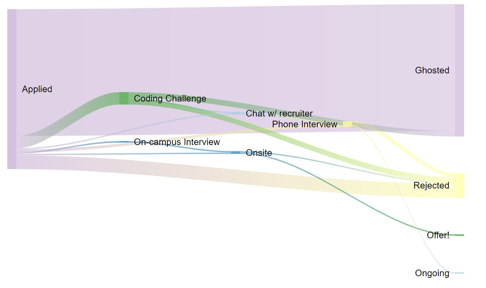

## Recruitment Sankey Diagram

This is a quick and dirty project to visualize how my internship hunt went. The diagram splits off into different "flows" depending on which steps of the recruitment process I completed for each company. The results are aggregated in this flow diagram, and the flow width is proportional to how frequently I reached a step.

This repo is purely for my own entertainment, so you won't see anything groundbreaking or interesting here. The code's pretty sloppy right now, but I'm thinking of cleaning it up soon so fingers crossed.

## What I did

I keep track of my applications and how I do in a google sheet. I parse the .csv file and format the aggregate information so that I can feed it into [Google's visualization tool](https://developers.google.com/chart/interactive/docs/gallery/sankey)

## Sample Outputs

I'm honestly super confused why more repositories don't show sample outputs of what their repo can do. It's super helpful and I would love to see more. But anyways, here's what my 2020 recruitment sankey diagram looks like.



## Creating Your Own Sankey Diagram

I'm not a Frontend person, and this project should make that veerrrry clear to you. In fact, if you're looking at this, I'm pretty sure it's a good warning sign for you to not hire me for frontend work. Regardless, this was originally meant to be a one-day project, but I came back to it because the code was annoying and my 2021 results didn't fit nicely. So I added a few things. But I'm probably not going to make this any better than it is now. If you want to do your own stuff, feel free to take this code and modify it as you see fit. Otherwise, feel free to judge because most of this is crappy code. I know.

If you're like me and want to do the bare minimum possible, then, to add your own Sankey Diagram: 
1. Replace the string in `parser.parseCSV` to a file path with your data in it
2. Replace the string in `parser.addAggregatesToResultsJS` to be a name of your choice
3. Run `python main.py`. This will create a new variable in `results.js` according to what you named it in step 2.
4. Go to sankey.html and add a new button with the correct variable name. It should look like this:

```
<div class="col sm d-flex m-1">
    <button type="button" class="btn btn-lg btn-outline-primary" onclick="loadChart(THE NAME FROM STEP 2)"> YEAR </button>
</div>
```
5. Be proud of your recruitment efforts :) 

## One Last Note

I have way more rejections than I show in my diagrams, so don't be discouraged even if you see a lot more! Good luck with your internship search :) 